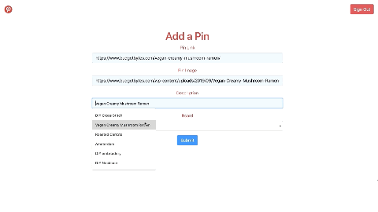

# Pinterest 2.0

## Description
The aim of this project was to build a site modeled after Pinterest using all four basic database operations, or CRUD ("Create", "Read", "Update", and "Delete"). In this application, the user can organize and save pins from all over the internet into neatly organized "boards" or categories.

### Feature List
The user can:
- CREATE new boards or pins
- READ currently saved boards or pins
- UPDATE currently saved pins
- DELETE boards or pins

## Tech Used
* SASS
* HTML
* JS with ES6 modules
* jQuery
* Webpack configuration
* Firebase with Google Authentication

## Build Status
[Deployed--View Live Site](https://pinterest-4db91.web.app/)

## Demo
